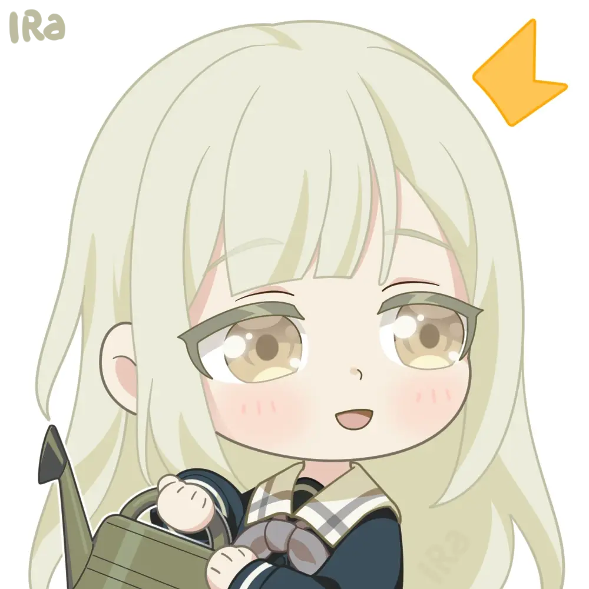

# Stickers WebP

此目录包含了转换为 WebP 格式的表情包。为了降低大小，所有转换都是有损的。

## Bilibili 表情

包含了哔哩哔哩弹幕视频网的表情和哔哩哔哩弹幕视频网的装扮、收藏集中的表情。

### 普通表情

#### [doge](./doge/)

包含部分已经下架的表情。

|           doge            |              doge_金箍              |             脱单doge              |                  少女乐团派对_派对                  |                   少女乐团派对_等一下                   |                  少女乐团派对_期待                  |                  少女乐团派对_感想                  |                  少女乐团派对_开心                  |                 颂乐人偶_眯眼笑                 |                颂乐人偶_笑了                |
| :-----------------------: | :---------------------------------: | :-------------------------------: | :-------------------------------------------------: | :-----------------------------------------------------: | :-------------------------------------------------: | :-------------------------------------------------: | :-------------------------------------------------: | :---------------------------------------------: | :-----------------------------------------: |
|  |  |  |  |  |  |  |  |  |  |

#### [小电视](./小电视/)

#### [2233娘](./2233娘/)

#### [蛆音娘](./蛆音娘/)

### 装扮与收藏集

#### [BanGDream](./BanGDream/)

https://www.bilibili.com/h5/mall/suit/detail?id=67861

|                           Poppin'Party                           |                            Afterglow                             |                     Hello, Happy World!                      |                           Pastel\*Palettes                           |                             Roselia                              |                          Morfonica                           |                           RAISE A SUILEN                           |                          MyGO!!!!!                           |
| :--------------------------------------------------------------: | :--------------------------------------------------------------: | :----------------------------------------------------------: | :------------------------------------------------------------------: | :--------------------------------------------------------------: | :----------------------------------------------------------: | :----------------------------------------------------------------: | :----------------------------------------------------------: |
|      |          |      |              |  |  |          |      |
|      |      |      |          |  |  |    |  |
|      |  |  |  |      |  |  |      |
|  |          |  |          |  |  |  |  |
|          |          |  |          |          |  |        |      |

#### [Mygo表情包](./Mygo表情包/)

https://www.bilibili.com/h5/mall/digital-card/home?act_id=102857

|                            高松灯                             |                           千早爱音                            |                           长崎爽世                            |                              要乐奈                               |                           椎名立希                            |
| :-----------------------------------------------------------: | :-----------------------------------------------------------: | :-----------------------------------------------------------: | :---------------------------------------------------------------: | :-----------------------------------------------------------: |
|          |          |  |      |      |
|  |          |  |      |  |
|      |          |  |          |          |
|          |  |          |  |      |

#### [良辰共此曲动态表情包](./良辰共此曲动态表情包/)

https://www.bilibili.com/h5/mall/digital-card/home?act_id=102857

|                                      千早爱音                                       |                                       高松灯                                        |                                      长崎爽世                                       |                                      椎名立希                                       |                                        要乐奈                                         |
| :---------------------------------------------------------------------------------: | :---------------------------------------------------------------------------------: | :---------------------------------------------------------------------------------: | :---------------------------------------------------------------------------------: | :-----------------------------------------------------------------------------------: |
|      |    |  |  |  |
|  |  |  |  |    |
|  |  |  |      |    |

#### [少女乐队的呐喊表情包](./少女乐队的呐喊表情包/)

https://www.bilibili.com/h5/mall/digital-card/home?act_id=104978

|                                      井芹仁菜                                       |                                     河原木桃香                                      |                                       安和昴                                        |                                          海老冢智                                           |                                            RUPA                                             |
| :---------------------------------------------------------------------------------: | :---------------------------------------------------------------------------------: | :---------------------------------------------------------------------------------: | :-----------------------------------------------------------------------------------------: | :-----------------------------------------------------------------------------------------: |
|  |  |  |          |  |
|      |      |  |          |          |
|  |  |  |          |          |
|  |  |  |          |          |
|  |  |      |  |          |

#### [孤独摇滚](./孤独摇滚/)

https://www.bilibili.com/h5/mall/suit/detail?id=234459001

|                                                     |                                                     |                                                 |                                                     |                                                         |
| :-------------------------------------------------: | :-------------------------------------------------: | :---------------------------------------------: | :-------------------------------------------------: | :-----------------------------------------------------: |
|      |      |      |      |          |
|      |  |      |      |          |
|  |      |  |      |  |
|          |      |  |  |          |
|      |      |  |      |  |

## 游戏表情

### [梦想协奏曲！少女乐团派对！](./stamp/)

https://bestdori.com/tool/explorer/asset/cn/stamp/01

|                         stamp_bilibili51                         |                         stamp_bilibili52                         |                         stamp_bilibili53                         |                         stamp_bilibili54                         |                         stamp_bilibili55                         |
| :--------------------------------------------------------------: | :--------------------------------------------------------------: | :--------------------------------------------------------------: | :--------------------------------------------------------------: | :--------------------------------------------------------------: |
|                |                |                |                |                |
|  |  |  |  |  |

### [雀魂麻将](./mahjongsoul/)

https://mahjongsoul.club/characters/emotes

|                      0                       |                      1                       |                      2                       |                      3                       |                      4                       |                      5                       |                      6                       |                      7                       |                      8                       |                       10                       |                       11                       |                       12                       |
| :------------------------------------------: | :------------------------------------------: | :------------------------------------------: | :------------------------------------------: | :------------------------------------------: | :------------------------------------------: | :------------------------------------------: | :------------------------------------------: | :------------------------------------------: | :--------------------------------------------: | :--------------------------------------------: | :--------------------------------------------: |
|  |  |  |  |  |  |  |  |  |  |  |  |

## 来自 UP 主的表情

### [春也Haruya](./春也Haruya/)

https://space.bilibili.com/3280

|            |                   唱歌                    |                   戳戳                    |                   大叫                    |                   大哭                    |                   刀子                    |                   点赞                    |                   端详                    |                    对手指                     |                   富了                    |                   鼓掌                    |                   喝茶                    |                   哼哼                    |                  慌                   |                   举牌                    |                   看报                    |                   可爱                    |                   可恶                    |                   口水                    |                   拉泪                    |                   灵光                    |                   摸头                    |                   拿来                    |                   破防                    |                   启动                    |                   穷了                    |                   上车                    |                   上吊                    |                   上工                    |                   生气                    |                   手帕                    |                   睡了                    |                   探头                    |                   贴脸                    |                   投降                    |                    玩手机                     |                   喜欢                    |                   想要                    |                   疑惑                    |                   震惊                    |                     自己画画                      |
| :--------: | :---------------------------------------: | :---------------------------------------: | :---------------------------------------: | :---------------------------------------: | :---------------------------------------: | :---------------------------------------: | :---------------------------------------: | :-------------------------------------------: | :---------------------------------------: | :---------------------------------------: | :---------------------------------------: | :---------------------------------------: | :-----------------------------------: | :---------------------------------------: | :---------------------------------------: | :---------------------------------------: | :---------------------------------------: | :---------------------------------------: | :---------------------------------------: | :---------------------------------------: | :---------------------------------------: | :---------------------------------------: | :---------------------------------------: | :---------------------------------------: | :---------------------------------------: | :---------------------------------------: | :---------------------------------------: | :---------------------------------------: | :---------------------------------------: | :---------------------------------------: | :---------------------------------------: | :---------------------------------------: | :---------------------------------------: | :---------------------------------------: | :-------------------------------------------: | :---------------------------------------: | :---------------------------------------: | :---------------------------------------: | :---------------------------------------: | :-----------------------------------------------: |
|   高松灯   |      |      |      |      |      |      |      |      |      |      |      |      |      |      |      |      |      |      |      |      |      |      |      |      |      |      |      |      |      |      |      |      |      |      |      |      |      |      |      |      |
|  千早爱音  |                                           |  |                                           |                                           |                                           |  |  |  |                                           |  |  |  |  |  |                                           |  |  |  |  |  |                                           |                                           |                                           |  |                                           |                                           |  |  |  |                                           |                                           |                                           |                                           |                                           |                                               |  |  |  |  |                                                   |
|   要乐奈   |  |  |  |  |  |  |  |  |  |  |  |  |  |  |  |  |  |  |  |  |  |  |  |  |  |  |  |  |  |  |  |  |  |  |  |  |  |  |  |  |
|  长崎素世  |  |  |  |  |  |  |  |  |  |  |  |  |  |  |  |  |  |  |  |  |  |  |  |  |  |  |  |  |  |  |  |  |  |  |  |  |  |  |  |  |
|  椎名立希  |  |  |  |  |  |  |  |  |  |  |  |  |  |  |  |  |  |  |  |  |  |  |  |  |  |  |  |  |  |  |  |  |  |  |  |  |  |  |  |  |
|  三角初华  |                                           |  |                                           |                                           |                                           |  |  |  |                                           |  |  |  |  |  |                                           |                                           |                                           |  |  |  |                                           |                                           |                                           |  |                                           |                                           |  |  |  |                                           |                                           |                                           |                                           |                                           |                                               |  |  |  |  |                                                   |
|   若叶睦   |      |      |      |      |      |      |      |      |      |      |      |      |      |      |      |      |      |      |      |      |      |      |      |      |      |      |      |      |      |      |      |      |      |      |      |      |      |      |      |      |
|  八幡海铃  |  |  |  |  |  |  |  |  |  |  |  |  |  |  |  |  |  |  |  |  |  |  |  |  |  |  |  |  |  |  |  |  |  |  |  |  |  |  |  |  |
| 祐天寺喵梦 |                                           |  |  |                                           |                                           |  |  |  |                                           |  |  |  |  |  |                                           |                                           |                                           |  |  |  |  |  |                                           |  |                                           |                                           |  |  |  |  |  |  |  |                                           |  |  |  |  |  |                                                   |
|  丰川祥子  |                                           |  |                                           |  |                                           |  |  |  |  |  |  |  |  |  |                                           |                                           |                                           |  |  |  |                                           |                                           |  |  |  |                                           |  |  |  |                                           |                                           |                                           |                                           |                                           |                                               |  |  |  |  |                                                   |

### [哈皮酱P](./哈皮酱P/)

https://space.bilibili.com/299029

#### 画个睦头人

|                          |                          |                          |                           |                           |
| :----------------------: | :----------------------: | :----------------------: | :-----------------------: | :-----------------------: |
|  |  |  |  |   |
|  |  |  |   |   |
|  |  |  |   |  |
|  |  |  |   |   |
|  |  |  |  |   |

#### 画个小睦头人

|                            |                             |                             |                             |                            |
| :------------------------: | :-------------------------: | :-------------------------: | :-------------------------: | :------------------------: |
|  |   |  |  |  |
|  |   |   |   |  |
|  |  |   |   |

#### MyGO小动画

|                             |                             |                             |                             |                            |
| :-------------------------: | :-------------------------: | :-------------------------: | :-------------------------: | :------------------------: |
|  |  |  |  |  |
|   |  |  |  |

### [言力华](./言力华/)

https://space.bilibili.com/406868

|                                          |                                            |                                            |                                            |                                            |                                          |                                            |
| :--------------------------------------: | :----------------------------------------: | :----------------------------------------: | :----------------------------------------: | :----------------------------------------: | :--------------------------------------: | :----------------------------------------: |
|  |  |  |  |  |  |  |
